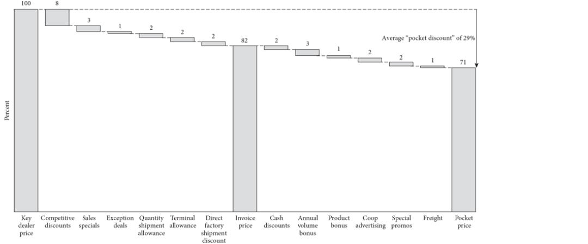

## Анализ требований и функциональные возможности
Цель: Разработка программного обеспечения, позволяющего автоматически изменять цены на номера в отелях в зависимости от различных факторов, таких как спрос, сезонность, конкуренты и т.д., с целью максимизации прибыли.

### 1. Основные функциональные возможности:

Импорт данных:
Информация о отелях (название, расположение, количество номеров, категории номеров).
Данные о тарифах (базовые цены, дополнительные услуги).
Исторические данные о бронированиях и ценах.
Данные о конкурентах (цены, доступность номеров).

Анализ данных:
Расчет спроса на основе исторических данных и текущих тенденций.
Определение оптимальных цен с учетом сезонности, праздников и других факторов.
Сравнение цен с конкурентами.
Идентификация трендов и аномалий.

Моделирование:
Разработка моделей машинного обучения для прогнозирования спроса и оптимизации цен.

Динамическое ценообразование:
Автоматическое обновление цен в реальном времени на основе результатов анализа и моделей.

Интеграция с существующими системами:
Система бронирования отелей.
Системы управления отелями (PMS).
Каналы продаж (OTA).

Отчетность:
Генерация отчетов о ценовой политике, эффективности системы, влиянии изменений цен на продажи.

### 2. Архитектура системы
Микросервисная архитектура:
Модульность и масштабируемость.

Сервисы: сбор данных, анализ данных, моделирование, ценообразование, интеграция.

База данных:
PostgreSQL или MongoDB для хранения больших объемов данных.
NoSQL база данных для хранения временных рядов и неструктурированных данных.

Фронтенд:
Веб-интерфейс для управления системой и визуализации данных.
Реализован на React или Vue.js.

Облачная инфраструктура:
AWS, GCP или Azure для развертывания и масштабирования системы.

### 3. Технологический стек
Язык программирования: GoLang (высокая производительность, масштабируемость, удобство для сетевых приложений).
Фреймворки:
Gin для создания веб-сервисов.
GORM для взаимодействия с базами данных.
PyTorch для разработки моделей машинного обучения.
Инструменты:
Docker для контейнеризации.
Kubernetes для оркестрации контейнеров.
Prometheus и Grafana для мониторинга.
supervisord - мониторинг и перезапуск?

### 4. Планирование проекта
Неделя 1-2: Анализ требований, проектирование архитектуры, выбор технологий.
Неделя 3-4: Разработка основных сервисов (сбор данных, хранение данных).
Неделя 5: Разработка моделей машинного обучения.
Неделя 6: Интеграция сервисов, тестирование системы.

### 5. Распределение задач между командой
Архитектор: Разработка общей архитектуры, выбор технологий.
Backend разработчики (3 человека): Разработка основных сервисов, интеграция с внешними системами.
Data Scientist: Разработка моделей машинного обучения.
Frontend разработчик: Разработка веб-интерфейса.

### 6. Риски и ограничения
Качество данных: Необходимость очистки и подготовки данных для обучения моделей.
Сложность моделей: Подбор оптимальных моделей машинного обучения для прогнозирования спроса.
Изменение внешних факторов: Необходимость постоянного мониторинга рынка и адаптации моделей.
Интеграция с существующими системами: Совместимость с различными форматами данных и API.

### 7. Метрики успеха
Точность прогнозирования спроса.
Увеличение средней стоимости бронирования.
Снижение уровня недозагрузки номеров.
Удовлетворенность клиентов.

### Общая схема оптимизации цены

### Каскад цен

